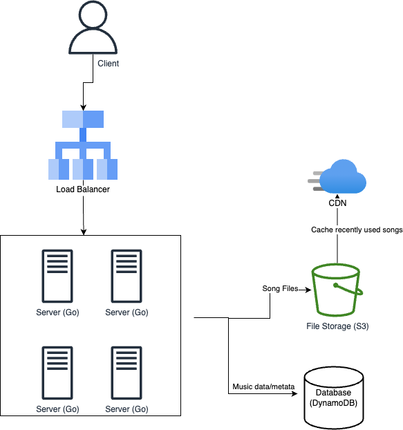

## 𝐑𝐞𝐪𝐮𝐢𝐫𝐞𝐦𝐞𝐧𝐭 𝐂𝐥𝐚𝐫𝐢𝐟𝐢𝐜𝐚𝐭𝐢𝐨𝐧𝐬

### 𝐅𝐮𝐧𝐜𝐭𝐢𝐨𝐧𝐚𝐥 𝐑𝐞𝐪𝐮𝐢𝐫𝐞𝐦𝐞𝐧𝐭𝐬

- The user should be able to play songs from the web interface
- The user should be able to search songs from the web interface

### 𝐍𝐨𝐧 𝐅𝐮𝐧𝐜𝐭𝐢𝐨𝐧𝐚𝐥 𝐑𝐞𝐪𝐮𝐢𝐫𝐞𝐦𝐞𝐧𝐭𝐬

- The system should be highly availiable, accessible 24/7 with limited outages
- The system needs to have a low latency. Music should stream without interruption
- The system should have high scalability, be able to handle large read requests

### Unsupported Functional Requirements

* User accounts and related features (likes, dislikes, playlists etc) (can be a future feature)

### Assumptions
* We assume an album have one artist (irl not true but assuming for simplification)
* We assume songs have one artist (same as above)
* We assume we will have more reads
* We assume albums are immutable

#### Limitations
* Due to dynamoDB having no support for partial searches, i'm only allowing full search for "SongName", "AlbumName" or "ArtistName". Potential solutions are to retrieve all of the data and do the search logic in go, but that would run into memory issues if the data became too large. (there is a [begins_with](https://docs.aws.amazon.com/amazondynamodb/latest/developerguide/ql-functions.beginswith.html) function but I'd have to Scan the whole table instead of taking advantage of my indexes so i'm going to nix that scenario). To solve case sensitivity we could simply store an additional field in all lower case, but I don't want to increase more fields at this point in time

## 𝐄𝐬𝐭𝐢𝐦𝐚𝐭𝐢𝐨𝐧𝐬

- Assume each song is approx 6mbs. If we assume the average song is 4 minutes, that's approximately 25,000kb per second (6,000,000kb/240sec) per user. If we're supporting 1,000 streams per second, then we should expect throughput of 2,500,000kb per second, or 2.5mb per second.
- Should support 1,000 QPS (long term, if there's anything that could cost money I'll forgoe that as this is simply a pet project)
- Music should be stored on a blob storage database and sent to the requesting client
- (not going to store a ton of music right now) let's say we need 100mb of storage for our music

## 𝐀𝐏𝐈 𝐃𝐞𝐬𝐢𝐠𝐧

```
/api/music/stream?songId={songId} -> retrieve song and stream the data back to the requestor

/api/music/search?searchTerm={keyword} -> search the database for song titles, albums, and artists that match the search term

/api/music/songs -> retrieve all song metadata in a user friendly format for display to the client
```

## Building Blocks

```
Database - used to store the metadata about the songs. Title, author, and album

Blob Storage - used to store the songs (S3)

CDN - Used to effectively deliver content to end users, reducing the delay and burder on the end-servers (probably CloudFront)

Load Balancer - Used to increase the number of servers that can handle client requests

Database indexing (see bottlenecks about partitioning/sharding) - are a necessity to distribute high loads of client requests
```

Other than those listed, we will need a server to run application logic and entertain user requests and a user interface to interact with the songs

### 𝐃𝐚𝐭𝐚𝐛𝐚𝐬𝐞 𝐒𝐜𝐡𝐞𝐦𝐚 𝐃𝐞𝐬𝐢𝐠𝐧

NoSQL database because I want to be able to scale horizontally to support large reads

## 𝐃𝐞𝐭𝐚𝐢𝐥𝐞𝐝 𝐃𝐞𝐬𝐢𝐠𝐧

### High level components



##### Algo/DS in use at a high level
* Load balancer will use Round Robin approach
* CDN will use LRU cache (last recently used, meaning storing x number of recently used song files in cache)

#### Scaling individual components

(see bottlenecks section for notes on database partitioning)

##### Replication & Redundancy

```
Redundancy - S3 and DynamoDB can have Cross-Region-Replication (if one region goes down we can fallback to another).

Replication - DynamoDB has support for multi-master replication, which allows writes to multiple regions at the same time
```

#### Databases

Some considerations to be made are whether to make a single table with all song information or to keep them in seperate tables. I decided to do the latter to make it easier to maintain data integrity, as well as decrease the number of indexes needed for search results (e.g. indexing on ArtistName would be a single index on the Artist table, but would be N indexes on the Songs table as the ArtistName would be duplicated for each song)

```
DynamoDB -- Document store for song metadata

Indexing on search fields
Key:
* - partition key (for indexing)
** - sort key to ensure uniquness (for indexing)

type Artist struct {
    ArtistID** string `json:"ArtistId"`
    ArtistName*    string `json:"ArtistName"`
    AlbumIDs  []string `json:"AlbumIDs"`
}

type Album struct {
    AlbumId**      string `json:"AlbumId"`
    AlbumName*    string `json:"AlbumName"`
    ArtistID string `json:"ArtistID"`
    SongIDs  []string `json:"SongIDs"`
}

type Song struct {
    SongId**      string `json:"SongId"`
    SongName*    string `json:"SongName"`
    ArtistID string `json:"ArtistID"`
    AlbumID  string `json:"AlbumID"`
}

S3 -- File store for songs
e.g. /{songID}.mp3
```

##### Transfer protocol

Uses REST/HTTP

### 𝐑𝐞𝐬𝐨𝐥𝐯𝐞 𝐛𝐨𝐭𝐭𝐥𝐞𝐧𝐞𝐜𝐤𝐬 𝐚𝐧𝐝 𝐟𝐨𝐥𝐥𝐨𝐰-𝐮𝐩 𝐪𝐮𝐞𝐬𝐭𝐢𝐨𝐧𝐬

#### Database Paritioning

If we were actually scaling to 1,000 QPS, we should parition the database tables on IDs. I don't do this above because I'm indexing on search fields so i'd need to maintain a map of shard keys to search fields, which is more than I want to do for this small project.

If growing further, you should do that though and use the following partition schema
```
i) Methods
Dynamo - Horizontal Partitioning on PK (see databases)

ii) Criteria
Hash-Based Partitioning (Consistent Hashing) on PK (see databases)
```

